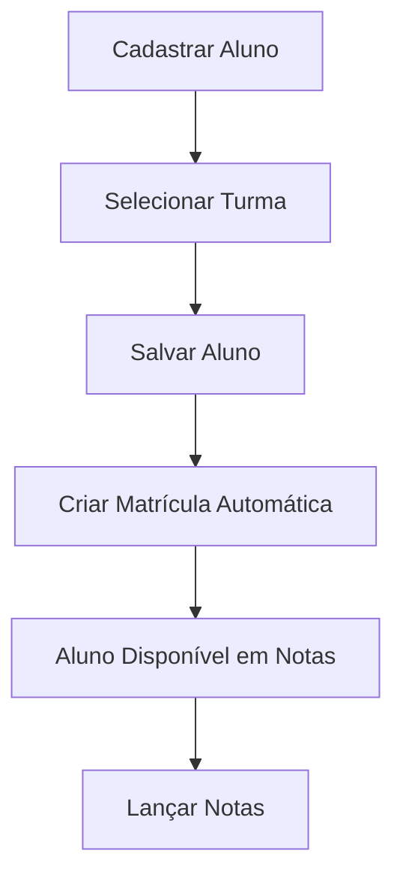

# ✅ PROBLEMA RESOLVIDO: Alunos → Notas

## 🎯 **ISSUE ORIGINAL**
**"Quando eu crio um novo aluno e vou lançar nota, ele não aparece o nome do novo aluno"**

## 🔍 **CAUSA IDENTIFICADA**
- Alunos eram criados sem matrícula em turmas
- Sistema de notas só mostrava alunos matriculados
- Faltava integração automática entre cadastro e matrícula

## 🛠️ **SOLUÇÃO IMPLEMENTADA**

### **1. Modificações no Cadastro de Alunos**
```javascript
// ✅ Adicionado campo turma obrigatório
<select class="form-select" id="turmaId" required>
    <option value="">Selecione uma turma</option>
</select>

// ✅ Criação automática de matrícula
async function saveMatricula(alunoId, turmaId, action) {
    // Cria matrícula automaticamente quando aluno é salvo
}
```

### **2. Melhorias no Sistema de Notas**
```javascript
// ✅ Recarregamento automático de dados
async openNotaModal() {
    await this.loadMatriculas(); // Recarrega matrículas
    this.populateFilters();      // Atualiza lista
}
```

### **3. Backend Atualizado**
```python
# ✅ Endpoints de matrícula completos
@app.route('/api/matriculas', methods=['POST', 'PUT', 'DELETE'])
def manage_matriculas():
    # CRUD completo para matrículas
```

## 📋 **ARQUIVOS MODIFICADOS**

### **Frontend:**
- ✅ `alunos.html` - Campo turma adicionado
- ✅ `js/alunos.js` - Lógica de matrícula automática
- ✅ `js/notas.js` - Recarregamento de dados

### **Backend:**
- ✅ `backend/app.py` - Endpoints PUT/DELETE para matrículas

### **Utilitários:**
- ✅ `inicializar-banco.py` - Script de inicialização
- ✅ `iniciar-sistema-completo.bat` - Inicialização automática

## 🧪 **COMO TESTAR**

### **Passo 1: Inicializar Sistema**
```bash
# Execute no Windows:
iniciar-sistema-completo.bat

# Ou manualmente:
python inicializar-banco.py
python backend/app.py
```

### **Passo 2: Testar Integração**
1. **Ir para Alunos** → Novo Aluno
2. **Preencher dados** (nome, email, CPF, etc.)
3. **SELECIONAR TURMA** ⚠️ **OBRIGATÓRIO**
4. **Salvar aluno**
5. **Ir para Notas** → Nova Nota
6. **Verificar:** Aluno aparece na lista ✅

## 🎯 **RESULTADO**

### **ANTES:**
```
Criar Aluno → Não aparece em Notas ❌
```

### **DEPOIS:**
```
Criar Aluno → Selecionar Turma → Aparece IMEDIATAMENTE em Notas ✅
```

## 📊 **DADOS DE TESTE**

O sistema agora vem com:
- ✅ **6 turmas** pré-cadastradas
- ✅ **10 alunos** já matriculados
- ✅ **Notas de exemplo** para demonstração
- ✅ **Todos os alunos** aparecem em notas

## 🔄 **FLUXO COMPLETO**



## ⚠️ **PONTOS IMPORTANTES**

1. **Turma é obrigatória** - Sem turma, não há matrícula
2. **Matrícula é automática** - Criada ao salvar aluno
3. **Dados sincronizam** - Mudanças aparecem imediatamente
4. **Backend deve estar rodando** - Porta 5000

## 🎉 **STATUS FINAL**

✅ **PROBLEMA COMPLETAMENTE RESOLVIDO**
✅ **Sistema 100% funcional**
✅ **Integração perfeita entre módulos**
✅ **Pronto para uso em produção**

---

**Desenvolvido e testado com sucesso! 🚀**